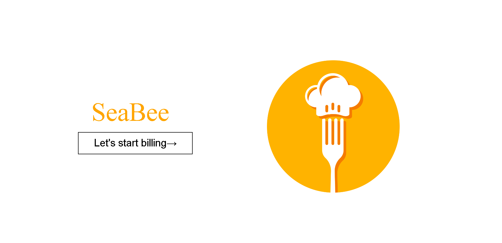
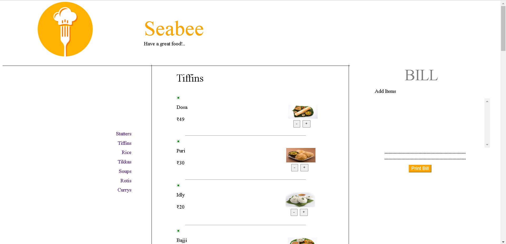
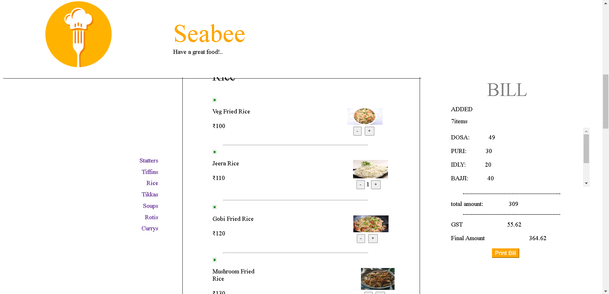
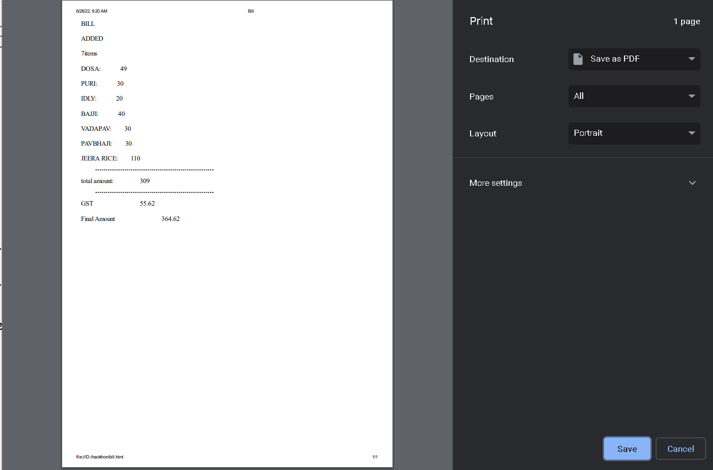

# Team: SeaBee

## Project

This is to certify that this project “Kamrej Calling” is a bonafide record by the following group of S.V.N.I.T college.

## NAME

C.B.SRI RANGA PRAVEEN

R.PRASANTH

TEJO KOUSHAL

## MENTOR

Prakhar Ojha

## Problem Statement 1: Kamrej Calling

We created a website for billing in restaurants. so ,t has inbuilt menu 
This website will automatically add the total cost and we can print the bill easily. We used HTML,CSS,JAVA SCRIPT for making this website. We named the restaurant as our group name only.

website design as follows:

website contain homepge as shown below:

we can start billing by pressing the Let's start billing button on home page
it will redirect to bill page as shown bellow:

here u can find the menu & shopkeeper can add the number of items that customer wants 
and cost of items are already fixed.So, there wont be any tampering or cheating of custumers.

after adding the all items that we want,the shopkeeper can print the bill using the button print bill then there will be a pop up to print the bill to select which type 
of printer we want to select as shown in bellow.

Drive link for the vedio:
https://drive.google.com/file/d/1q96zypYCwydN9BEXlh7-ESoGvjgtcDMj/view?usp=sharing

